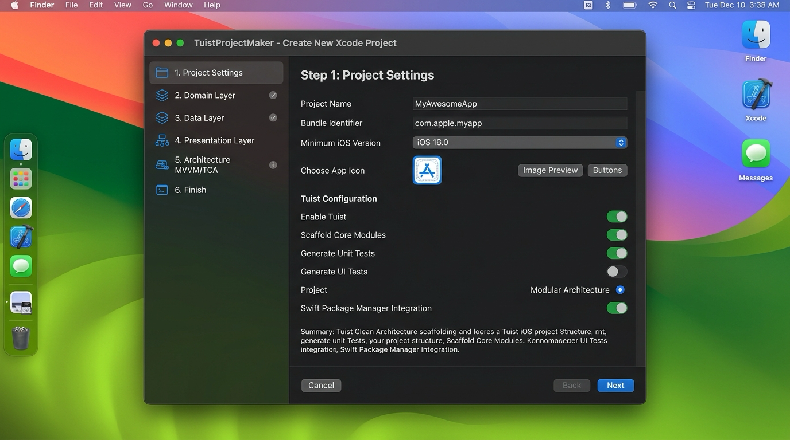

🇰🇷 [한국어](README.md) | 🇺🇸 [English](README.en.md) | 🇯🇵 [日本語](README.ja.md) | 🇨🇳 [中文](README.zh.md)

<p align="center">
  
</p>

<h1 align="center">TuistProjectMaker</h1>

<p align="center">
  基于 Tuist 与清晰架构（Clean Architecture）脚手架生成 iOS 项目的 macOS 原生图形向导工具。
</p>

<p align="center">
  
</p>

## 安装指南

### Homebrew
```bash
brew tap mrKangHo/tap
brew install tuistprojectmaker
```
